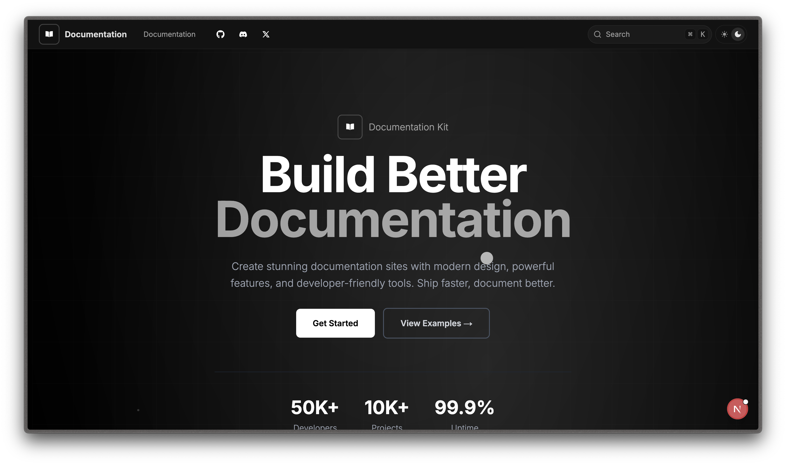
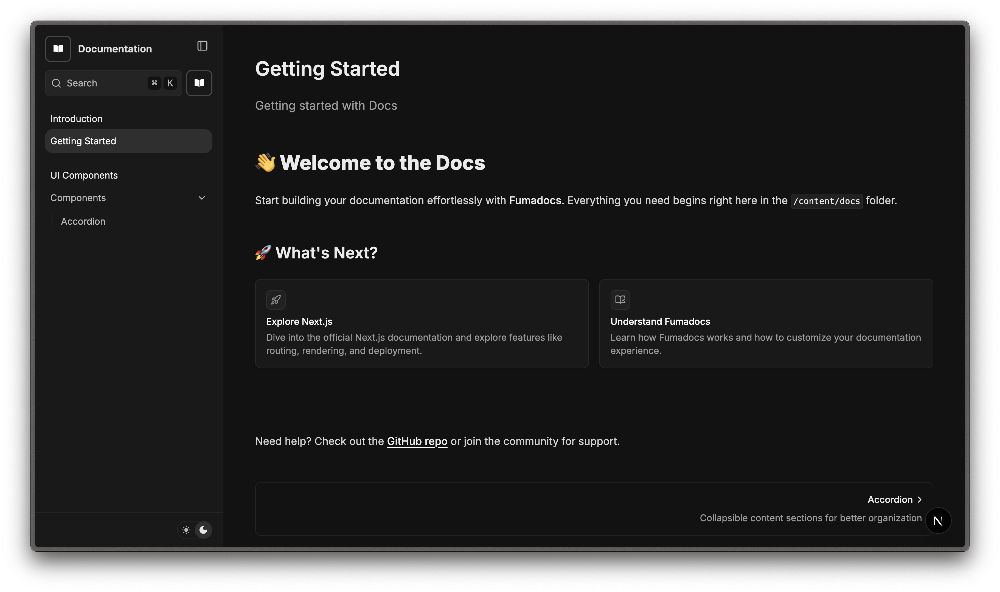
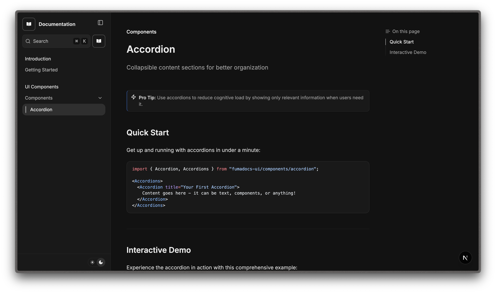

<!-- Banner -->
<p align="center">
  
</p>

<table>
  <tr>
    <td></td>
    <td></td>
  </tr>
</table>

<div align="center">
  <p>
    
    
    
    
  </p>

<p align="center">
  
</p>
</div>

<h1 align="">📘 Modern Doc Template</h1>

<p align="">A minimalist documentation system built with <b>Next.js</b> and powered by <a href="https://fumadocs.dev/" target="_blank"><b>Fumadocs</b></a>.</p>

## ⚙️ Getting Started

Install dependencies and run the development server:

```bash
$ git clone https://github.com/rit3zh/modern-docs-template
$ cd modern-docs-template
```

Running the development server

```bash
$ pnpm install
$ pnpm dev
```

Visit [http://localhost:3000](http://localhost:3000) in your browser.

## 📁 Project Structure

```bash
.
├── app/
│   ├── (home)/              # Landing and custom pages
│   ├── docs/                # MDX-based documentation
│   └── api/search/          # Search API route
├── lib/source.ts            # Fumadocs content adapter (loader)
├── layout.config.tsx        # Layout options
├── source.config.ts         # MDX config (frontmatter, sidebar, etc.)
```

---

## ✍️ How to Write Docs

1. Create `.mdx` pages inside the `app/docs/` folder.
   Example:

   ```bash
   app/docs/guide/getting-started.mdx
   ```

2. Customize sidebar, groups, and ordering in `source.config.ts` using `defineConfig()`.

3. Use Fumadocs UI components directly in your MDX:

   ```mdx
   import { Card } from "fumadocs-ui/components/card";

   <Card title="Welcome" href="/docs/start" />
   ```

Learn more in the [Fumadocs MDX Guide →](https://fumadocs.dev/docs/mdx)

---

## 🛠 Customization

| Feature    | How to Customize                                    |
| ---------- | --------------------------------------------------- |
| Branding   | Update logo, favicon, meta in `app/layout.tsx`      |
| Navigation | Edit sidebar/nav in `source.config.ts`              |
| Theme      | Light/dark support is built-in                      |
| Search     | Tweak `app/api/search/route.ts` for search behavior |

---

## 📚 Learn More

- 🔗 [Fumadocs Documentation](https://fumadocs.dev)
- 🔗 [Next.js Documentation](https://nextjs.org/docs)
- 🔗 [Learn Next.js](https://nextjs.org/learn)

---

## 💬 Community & Support

- 🐙 GitHub: [github.com/rit3zh/modern-doc-template](https://github.com/rit3zh/modern-doc-template)
- 💬 Discord: [Rit3zh](http://discordapp.com/users/755101874268536893)
- ☕ Buy Me a Coffee: [buymeacoffee.com/rit3zh](https://buymeacoffee.com/rit3zh)

> Built with ❤️ by [rit3zh](https://github.com/rit3zh) — clean, fast, and fully extensible.
